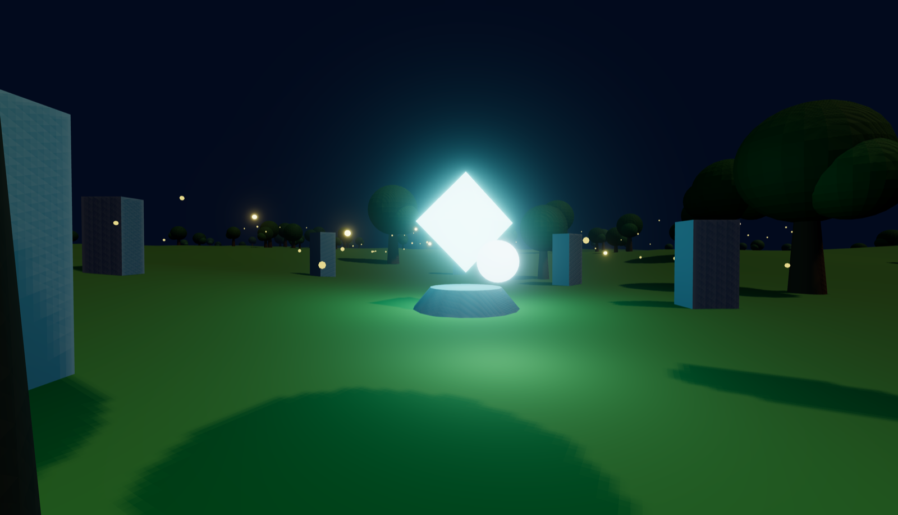

# GAIA World Engine

An AI-native 3D game engine where the world is a live database and every
change — by you, by a tool, by an AI — appears instantly while you walk
around inside it. Half game, half engine.



## What it is

GAIA is a thin engine built on three.js (WebGPU, WebGL fallback) and a small
Node world server. There is no build step for content and no scene files in
the classic sense: a world is a set of **entity documents** — plain JSON
components like `mesh`, `light`, `sound`, `behavior` — stored on the server.
The 3D client renders whatever the server says exists. Change a document and
every connected viewer sees the change the same instant. 3D only.

## Vision

The engine is built for **co-creation**: a Dreams-like space where a player
and AI agents shape a world together, live, from inside it. Three ideas
carry everything:

1. **The world is data.** Every entity is a document of components. Code
   lives in a small, stable kernel; everything authored is hot-swappable
   content — geometry, shaders, sound patches, weather, behaviors.
2. **Everything is a client.** The player, the in-world editor, the CLI
   tools, and AI agents all speak the same patch protocol to the same world
   server. There is no privileged editor and no special AI side-channel.
3. **No rebuilds, ever.** A change is a patch; a patch applies in
   milliseconds. You never leave the world to work on the world.

Because agents are just clients, an AI can build alongside you — and it
doesn't need eyes to do it: the engine gives it text senses (look frames,
maps, queries, lint) and embodied intents, with screenshots reserved for
judging beauty rather than correctness.

## Quick start

```sh
npm install
npm run dev       # world server on :8420 + vite client on :5173
```

Open http://localhost:5173 and click to enter.

**Play mode** — WASD move, mouse look, shift run, esc releases the pointer.
**E** grabs the entity under the crosshair (scroll to push/pull, E again to
drop) — carries stream live to every client. **V** toggles noclip flight,
**G** toggles game mode (editing and HUD off — worlds whose `spawn` has
`gameMode: true` start locked), **~** opens the debug panel (brightness),
**M** mutes the audio (the choice persists per browser; `?mute=1` in the
URL starts a tab muted).

**Creator mode** — **Tab** toggles it, with Unity-style controls:

- Click anything to select it (terrain included); **Q/W/E/R** =
  view/move/rotate/scale tools, **F** frames the selection.
- Hold **RMB** to fly (WASD + Q/E down/up), **V** latches flight,
  **⌥-drag** orbits the selection, scroll dollies.
- The **outliner** (left) lists every entity grouped by scene — searchable,
  and the only way to reach the bodiless ones: triggers, water volumes,
  ambience patches, the environment itself. Click selects, double-click
  flies there; the ⛭ on a scene group opens its streaming entry (bounds,
  load volumes) in the inspector.
- **Gizmos** draw the invisible data as x-ray overlays: collider boxes
  (green walkable, red blocker), trigger volumes, water surfaces, light and
  sound ranges, ferry routes with direction arrows, scatter footprints,
  scene bounds and load cages. The selected entity always shows its own;
  the chips at the top of the outliner switch whole categories on.
- The **inspector** is schema-aware: every component shows what it means,
  every field has a tooltip and a sane slider range, and the add menu
  covers the whole vocabulary. A runtime strip shows the entity's scene,
  whether it is streamed in, and where the kernel actually has it.
- **L** opens the **world log**: the live op stream — watch triggers fire,
  weather write the sky, agents edit — filterable, with presence noise
  hidden by default.
- The inspector panel auto-generates sliders, color pickers, and dropdowns
  from the entity's JSON (raw JSON tab included). **⌘D** duplicates,
  **⌫** deletes, **⌘Z/⌘⇧Z** undo/redo your own edits as inverse ops.
- The bottom palette stamps prefabs with a ghost preview. Prefabs live on
  the server, so an agent can hand you new brushes at runtime.
- Lifting a grounded entity with the Y arrow edits its terrain-relative
  `ground.offset`, so it hovers with the ground it belongs to.

State lives as **scene files**: `world/scenes/<name>.json` holds the entity
documents (the source of truth, committed to git), `world/world.json` is the
superscene — which scenes exist and how they compose. Every dev edit writes
back into the scene files; the player layer saves separately. See "The scene
model" below.

## How it works

One Node server (`:8420`) owns the canonical world: a map of entity id →
component document. Clients connect over WebSocket, receive a snapshot, and
then exchange **ops**:

```
spawn   create an entity from components
set     replace one component (null removes it)
merge   shallow-merge into a component
despawn remove an entity
event   transient broadcast (journaled, never persisted)
```

```
reset   re-read a scene's files from disk and re-seed it (or the whole
        world) — entities with a `persist` component, presences, and
        unclaimed entities (world state) keep their current truth
use     a presence uses an entity's `interact` component on purpose
        ({op:'use', id, by}) — the server gates range/when/cooldown and
        applies the component's event + ops. Send it alone: it expands
        against the world as it was BEFORE the batch it travels in.
scene   edit a scene's world.json entry live ({op:'scene', name, value} —
        bounds, neighbors, load volumes; null deletes a key)
material edit world/materials.json live ({op:'material', name, value}) —
        clients rebuild whatever references the name
```

`merge` on a missing entity materializes it — world flags appear on first
write (`node tools/patch.mjs state gate open` merges into a `world-state`
entity that triggers can condition on).

Every applied op is broadcast to all clients and recorded in a journal
(`GET /events?since=`), which is the world's nervous system: tools and
agents tail it to react to lightning strikes, prefab changes, chat, anything.

On the client, a reconciler turns documents into three.js objects and keeps
them in sync as ops arrive. Visual and audio richness is data too:

- mesh parts take **shader presets** (`glow`, `flame`, `water`, `hologram`,
  `beam` for volumetric light shafts) — TSL node materials with a safe
  fallback;
- `scatter` and `particles` become instanced draw calls (hundreds of trees
  or motes per entity);
- `sound` patches describe layered synths (noise/osc → filter → LFO →
  reverb) built on the Web Audio graph, with sample files as an alternative;
- `environment` is one patchable entity for fog, sky, sun, bloom, and the
  audio buses; `weather` simulates lightning and rain cycles server-side.

A world clock keeps motion deterministic: orbits and bobs are pure functions
of time, so every client — and the server's senses — agree on where a moving
thing is.

### Patch the world while it runs

```sh
node tools/patch.mjs spawn '{"transform":{"position":[5,0,5]},"ground":{},"mesh":{"parts":[{"shape":"box","color":"#c0392b"}]}}' my-box
node tools/patch.mjs merge my-box transform '{"scale":2}'
node tools/patch.mjs set my-box behavior '{"type":"spin","speed":2}'
node tools/patch.mjs despawn my-box
```

Or POST raw ops to `http://localhost:8420/op`:
`{"ops":[{"op":"spawn","id":"x","components":{...}}]}`.

## Agents sense & act (no eyes needed)

Perception is text, not pixels — compact, fast, and native to a language
model:

```sh
node tools/agent.mjs look            # ranked text viewport from the avatar's pose
node tools/agent.mjs map 0 0 25      # ASCII terrain + entity map
node tools/agent.mjs describe crystal
node tools/agent.mjs query --has sound
node tools/agent.mjs check           # semantic lint: floaters, overlaps, dark lights
node tools/agent.mjs events 0        # tail the op journal
```

`GET /schema` returns the full component vocabulary with docs, ranges, and
enums — the same data the inspector builds its UI from.

Acting is embodied. The first intent spawns a visible glowing avatar that
travels at finite speed over the terrain — watch it walk from the client:

```sh
node tools/agent.mjs move 0 6        # walk there; returns the next look frame
node tools/agent.mjs face crystal | grab firefly-1 | drop | say "hi"
```

HTTP: `GET /sense/{look,map,describe,query,check}`, `POST /act`. Each player
publishes a presence entity, so agents can see and walk to people. The slow
path still exists: `node tools/agent.mjs shot out.png` captures a real
screenshot through a connected browser tab (the tab must be visible) — for
judging beauty, not correctness.

## Worlds are projects

A world is a directory, not a fork of the engine:

```sh
GAIA_WORLD=/path/to/project/world npm run dev
```

The engine loads that directory's `scenes/`, `world.json`, `prefabs/`,
`materials.json`, `game.json`, and `assets/` — so games live in their own
repos. Without `GAIA_WORLD`, the engine's own `world/` (the hub world above)
is used. Worlds run side by side: `GAIA_PORT` moves the world server,
`GAIA_CLIENT_PORT` moves vite, `GAIA_SAVE` names the player save.

### The scene model: one world, one state

A world is `world/world.json` — the **superscene**: which scenes exist and
how they compose (bounds discs, neighbors, `load` volumes, world defaults
like `voidY`) — plus `world/scenes/<name>.json`: pure entity documents keyed
by id, world-space. The scene files are THE source of truth: read at boot
and on `reset`, and every dev edit (gizmo drag, inspector field, palette
stamp, debug-menu save) writes back into them — Unity semantics, change a
thing in the editor and the scene file changes. The player layer (presences,
`persist` entities, entities no scene claims) lives apart in
`world/saves/player_<GAIA_SAVE>_state.json` (gitignored): scenes always win
on boot, the save only overlays the player's own.

```json
{ "voidY": -120, "scenes": {
  "shore":    { "bounds": { "center": [0,0],    "radius": 300 }, "neighbors": ["caves"] },
  "caves":    { "bounds": { "center": [0,-420], "radius": 200 }, "neighbors": ["shore"],
                "load": [{ "center": [10,-380], "radius": 30, "y": [-40, 10] }] },
  "backdrop": { "always": true }
} }
```

Clients stream invisibly: the current scene, its neighbors, and `always`
scenes (backdrops) are resident; a scene with `load` volumes streams in only
while the observer stands inside one (the Dark Souls model). The whole world
warms once at load, then streaming is pure visibility — nothing builds or
compiles mid-play. Scene entries may be **prefab instances**
(`{"prefab": "torch", ...deltas}`) that deep-merge `world/prefabs/<name>.json`
under their deltas; `world/materials.json` holds named looks mesh parts
reference by name. Editing files on disk while the server runs? Send a
`reset` op — it re-reads from disk (the pickup gesture for generator
re-runs). A world with no world.json and one scene file is the blank page:
a single implicit always-loaded scene named `main`.

A world with a `game.json` gets a **title screen** (NEW GAME / LEVEL
SELECT): levels are pure data — `{ id, name, spawn, reset, ops }`, the ops
running with `$id` resolved to the choosing presence. `?level=<id>` deep-
links straight into one.

## Component vocabulary

The canonical, always-current version of this list — with field docs,
ranges, and enums — is `shared/schema.js`, served live at `GET /schema`.

- `transform` — `{position:[x,y,z], rotation:[rx,ry,rz], scale: n|[x,y,z]}`
- `ground` — `{offset: n}` snap y to terrain height (re-snaps when terrain changes)
- `mesh` — `{parts:[{shape, color, emissive, roughness, opacity, preset, position, rotation, scale, ...shape params}]}`
  - shapes: `box(size)`, `sphere(radius)`, `cylinder(radiusTop,radiusBottom,height)`,
    `cone(radius,height)`, `torus(radius,tube)`, `octahedron(radius)`,
    `icosahedron(radius)`, `plane(size)`
  - `preset: glow|flame|water|hologram|beam|sky|overcast|clouds|abyss|stone`
    — TSL shader materials as data; `visible:false` parts collide without
    rendering; `solid:false` opts out of collision; `fog:false` makes
    backdrop silhouettes immune to scene fog
- `light` — `{type: point|spot|directional, color, intensity, distance, offset, castShadow}`
- `sound` — `{kind: hum|chime|patch|sample, ambient?, level, refDistance}`
  - `patch`: `{layers:[{source: noise|sine|square|sawtooth|triangle, freq, filter, gain, lfo, reverb}]}` — layered ambience as data
  - `sample`: `{url: "assets/file.ogg", loop, rate}` — files served from `world/assets/`
- `sfx` — `{on: <event>, wave, freq, freqEnd, attack, decay, level, lowpass, sweep, reverb}` — one-shot synth triggered by events, positional at its entity
- `behavior` — one or an array of `{type: spin|bob|orbit|path|pulse|flicker, ...}`
  (`path` follows waypoints at constant speed on the world clock — ferries,
  patrols; a waypoint's 4th number is a dwell: seconds parked there — stops)
- `terrain` — `{seed, size, segments, amplitude, frequency, color}` (per scene)
- `collider` — `{boxes:[{size, position, blocker?}]}` — analytic surfaces
  (entity-relative, yaw-aware): walkable tops make decks and bridges standable
  (and rideable when the entity moves); `blocker: true` boxes push bodies out — walls
- `water` — `{level, area:{center,size|radius}, drownAfter?}` — swimmable water;
  with `drownAfter`, swimming exhausts the soul in seconds: sink, `drown` event,
  respawn at the spawn point
- `trigger` — `{area, yMin?, yMax?, on: enter|exit, when?, cooldown?, event?, ops?}` —
  server-side volume watching every presence; on the enter/exit edge it emits
  the event and applies the ops (`$now` → world time, `$id` → who entered).
  `when: {"world-state.state.gate": "open"}` gates firing on world flags.
  World logic as data.
- `interact` — `{prompt, radius?, when?, cooldown?, event?, ops?}` — press-E
  world logic: look at the entity in range and the prompt appears; E sends a
  `use` op and the server fires the event + ops under trigger rules. One-shots
  set their own interact to null inside `ops` (the lantern ritual)
- `persist` — survives the `reset` op: the world re-seeds around it while it
  keeps its current state (the *Braid* rule — death resets all but the woven)
- `spawn` — `{position, yaw, gameMode?}` — where players enter (`gameMode:
  true` starts them with editing locked); also the void return: falling past
  world.json's `voidY` (default −120, per-scene overridable) teleports a
  body back to its last safe ground, or the spawn point if it never had one
- `scatter` — `{seed, count, area, instance:{parts}, scale, tilt, density, minHeight, maxHeight}` — instanced copies, terrain-following, noise-clustered
- `particles` — `{seed, count, size, color, area, motion:{type: drift|rain, ...}}` — animated instanced motes
- `environment` — `{background, fog, exposure, hemisphere, sun, ambient, bloom, audio}` —
  world mood as one patchable entity (`ambient: {color, intensity}` is the
  skylight: a true global light, the thing to raise when "more light" is the note)
- `weather` — `{lightning, minGap, maxGap, rainCycle, rainAmount, rainBase}` — server-simulated events
- `scene` — `{name}` — stamped by the server: which scene file owns the entity
- `prefab` — `{name}` — this entity is an instance of `world/prefabs/<name>.json`

## Architecture

```
server/          canonical world store, scene files + write-back, patch hub
                 (ws+http), op journal, sense API, intent engine, weather sim
client/kernel/   renderer, store mirror, view reconciler, terrain, player,
                 editor (+ path/hole lenses), audio synth, behaviors, scenes
shared/          pure functions every observer must agree on: terrain math,
                 motion, scene composition, op semantics, the schema
tools/           patch.mjs (raw ops), agent.mjs (sense + act CLI),
                 cdp.mjs (DevTools protocol: eval + DOM screenshots)
world/           the default hub world (scenes, world.json, prefabs, assets)
```

State lives on the server; the vite client hot-reloads freely around it.

## Roadmap

See [plan.md](plan.md) — M1–M15 are done: in-world editing, agent senses
and intents, inspector, instancing and shader presets, procedural audio,
observability, zones & streaming (M7), bodies in space — gravity, swim,
rideable platforms, blockers (M8), world logic — triggers, state,
persistence rules (M9), the outliner + gizmo layer (M10), the schema-
driven inspector + world log (M11), deliberate interaction + ferry
dwells + stacked floors + deep-world rendering (M12), and invisible
streaming + the light pool (M13: the world warms once at load and stays
resident, zones stream by visibility, runtime point lights share 16
pooled slots — no shader ever compiles mid-play; every zone seam and
every lantern lit measured ≤ 13ms), and the carried light (M14: a light
component on a presence rides its player's camera — carried ahead in the
camera's flat frame, so it lights where you're going and never blocks the
view; presences re-stamp their zone as they move; per-tab identity
survives reloads). The Later list holds scripting, full TSL authoring,
and multiplayer attribution.
